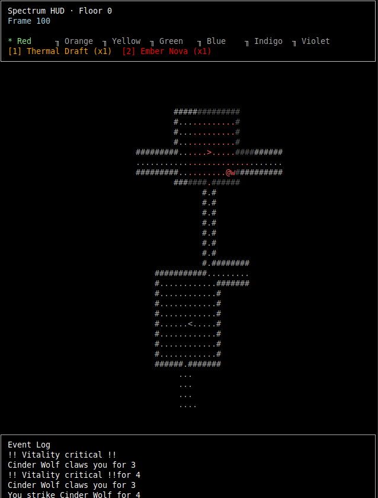

# RainbowRogue


_Console-native roguelike exploring a seven-world (4D) dungeon rendered with `bracket-lib`._

## Description
RainbowRogue drops you into a stacked dungeon where every floor exists simultaneously across seven attunement planes: Red, Orange, Yellow, Green, Blue, Indigo, and Violet. Each plane is its own tactical layer with bespoke hazards, monster templates, and traversal rules. You can phase between worlds mid-run, scout overlapping geometries, and line up multi-world plays—stepping through a smoldering Red corridor before blinking into Indigo for a flank, or freezing foes in Blue so their echoes in Violet arrive staggered.

### Core pillars
- **Spectrum shifting**: Cycle worlds on demand to discover alternate tile sets, portals, and monster behaviors sharing the same substrate.
- **Floor and world mobility**: Climb floors via stairs while keeping your current world, or phase worlds on the fly while staying anchored to a floor.
- **ECS-driven encounters**: Specs-powered components drive AI, visibility, quick actions, and cross-world synchronization so every action can ripple between planes.
- **Readable, moddable data**: Monsters, world rules, and procedural substrates live in `src/data` so you can iterate on balance without touching the loop.

## Quick Start
### Prerequisites
- Rust toolchain (1.80+ recommended; install via [rustup](https://rustup.rs)).
- A Unicode-friendly terminal.

### Build & run
```bash
# clone and enter the repo
git clone https://github.com/<your-org>/rainbowrogue.git
cd rainbowrogue

# run in debug (fast iteration)
cargo run

# for smoother animation and optimized AI ticks
cargo run --release
```

### Troubleshooting
- On macOS, grant the terminal “Input Monitoring” to ensure crossterm receives PageUp/PageDown events.
- If fonts render incorrectly, force ASCII glyph mode by exporting `BRACKET_ASCII_FONT=1` before launching.

### Persistent data
- `run_stats.json` in the project root tracks your run counter and best depth even if you close the game. Delete the file (or press `R` twice while alive) to reset progress completely.
- Set `RR_VERBOSE=1` (or run with `--verbose`) to stream the in-game message log and final turn transcript to stdout—handy for automated playtests (e.g., `RR_VERBOSE=1 cargo run` or `cargo run -- --verbose`).

## Player Manual
### Objective
Descend through as many dungeon floors as you can, unify the spectrum by activating portals in each world, and survive the cross-world ecosystems trying to collapse the lattice.

### Controls
| Action | Keys |
| --- | --- |
| Move Up | `Up Arrow`, `W`, `K`, `Numpad 8` |
| Move Down | `Down Arrow`, `S`, `J`, `Numpad 2` |
| Move Left | `Left Arrow`, `A`, `H`, `Numpad 4` |
| Move Right | `Right Arrow`, `D`, `L`, `Numpad 6` |
| Move Up-Left | `Y`, `Numpad 7` |
| Move Up-Right | `U`, `Numpad 9` |
| Move Down-Left | `B`, `Numpad 1` |
| Move Down-Right | `N`, `Numpad 3` |
| Wait | `.` |
| Cycle worlds forward/backward | `Tab` / `Backspace` |
| Change dungeon floor | `PageUp` (descend while on `>`) / `PageDown` (ascend while on `<`) |
| Restart run / reset stats | `R` (restart after death; double-press while alive to wipe run stats) |
| Use quickbar item slots | `1`–`4` |
| Close the game | `Esc` or close the terminal window |
| **Debug:** Step Turn | `T` (forces a turn advancement) |
| **Debug:** Dump State | `P` (dumps current game state to verbose log) |


Tips:
- Movement spends a turn even if blocked; watch the combat log to know whether you bumped an enemy or a wall.
- Cycling worlds re-centers AI intent, so you can shake pursuit or force monsters to rematerialize on safer tiles.

### HUD & feedback
- **Top banner**: Shows build tag, current frame, and overall turn counter.
- **Run tracker**: Row 2 displays the current run number and the deepest floor you've cleared across all runs this session.
- **World + floor readout**: Highlights your active world name and floor index.
- **Stair indicator**: When you stand on `<` or `>` tiles the info line appends `On < …` or `On > …`, and a color-coded `^` (ascend) or `v` (descend) badge appears near the quickbar so you know PageUp/PageDown will work even without reading text.
- **Vitality line**: Displays HP in color-coded text (orange warning ≤60%, flashing alert ≤30%).
- **HUD ring**: Seven wedges represent ROYGBIV worlds with cooldown pips and modifiers.
- **Quickbar**: Appears on row 5 with `[slot] name (uses)` entries for consumables bound to keys `1`–`4`.
- **Message log**: Bottom six rows narrate movement, discoveries, combat rolls, and health warnings.

### The Seven Worlds
Each world has its own unique properties, monsters, and tactical considerations.

- **Red World**: "Heat blooms amplify melee damage."
  - **Monsters**: Ember Imp, Cinder Wolf
- **Orange World**: "Chemical clouds respond to wind tunnels."
  - **Monsters**: Acid Puff, Flask Golem
- **Yellow World**: "Lens-prisms extend FOV and detect traps."
  - **Monsters**: Prism Ghost, Sun Mite
- **Green World**: "Regrowth tiles slowly mend allies."
  - **Monsters**: Thorn Hopper, Bloom Sentinel
- **Blue World**: "Stillwater grants crit bonuses to ranged."
  - **Monsters**: Glacier Crab, Stillwater Shade
- **Indigo World**: "Mindstorms favor teleport talent rolls."
  - **Monsters**: Mindworm, Phase Stalker
- **Violet World**: "Curses thread through unseen resonance."
  - **Monsters**: Hex Bat, Veil Revenant

### Traversal & combat
1. **Substrate awareness**: Every floor shares geometry across worlds; walls in one plane might be passable or hazardous in another.
2. **Portals vs. stairs**: Stairs move floors but preserve your current world. Portals (and attunements) swap worlds while staying on the same floor. Descending only works while standing on a downward stair (`>`), and ascending requires the matching upward stair (`<`) so you can't spam PageUp/PageDown mid-room.
3. **Visibility**: Exploring reveals tiles per-world. Swapping worlds can expose unseen tiles even on rooms you already visited.
4. **Monsters**: Each world seeds its own monster templates; leverage vulnerabilities (e.g., frost-stalled Blue mobs, psychic Indigo casters).
5. **Consumables**: Slots trigger instant abilities (heals, prisms, buffs). When empty, the log will remind you the slot is vacant.

### Progression pointers
- Descending for the first time auto-generates the next floor and populates it with world-appropriate monsters; use this to farm safer stretches before pushing deeper.
- Revisit earlier floors after unlocking more worlds to loot gated rooms or rescue stranded portals.
- Keep an eye on the log after shifts—newly visible tile counts hint at unexplored branches.
- If HP warnings trigger, stabilize in a safer world (Green regen zones, Yellow visibility) before diving back into harsher planes.
- If your HP hits zero the spectrum collapses, freezing the run; press `R` to re-anchor into a fresh run or `Esc` to exit immediately.
- Run stats persist between sessions via `run_stats.json`, so try to push the "Deepest cleared floor" number higher each attempt.

## Contributing
See `ROADMAP.md` for the staged milestone breakdown and use `bd` (beads) issues for task tracking. Planning documents belong in `history/` if you generate new ones.
